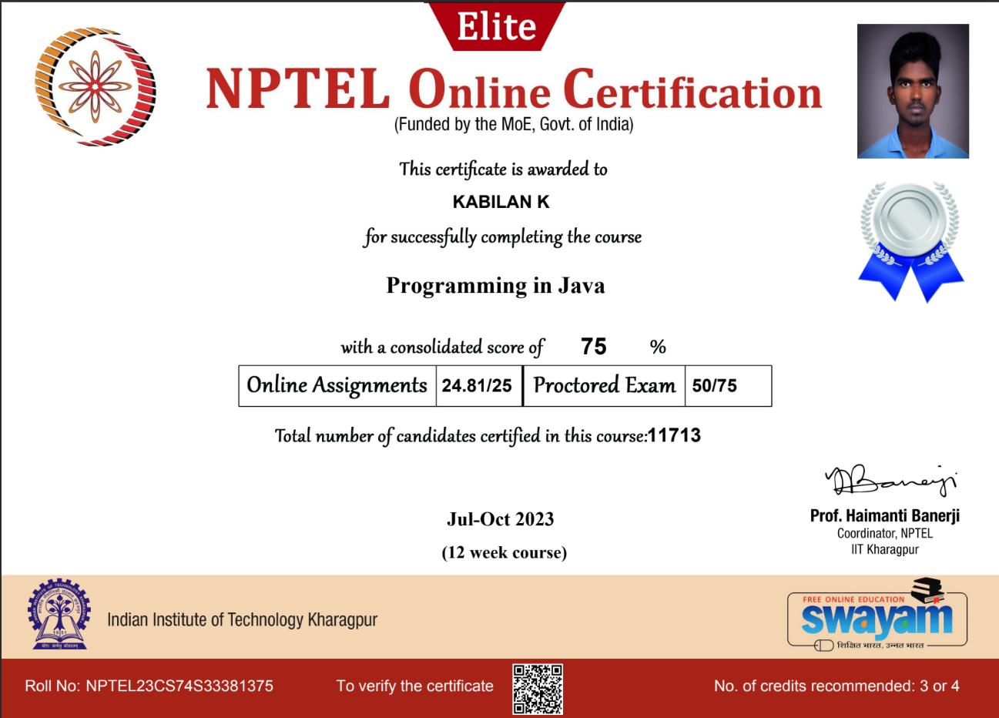

# NPTEL Programming in Java Course

## Overview

This repository contains my solutions and notes for the NPTEL Java Programming course. The course covers fundamental Java concepts and aspects of Object-Oriented Programming.

### Course Details

- **Credit Points:** 3
- **Start Date:** 24 Jul 2023
- **End Date:** 13 Oct 2023
- **Exam Date:** 29 Oct 2023

## Topics Covered

1. Overview of Object-Oriented Programming and Java
2. Java Programming Elements
3. Input-Output Handling in Java
4. Encapsulation
5. Inheritance
6. Exception Handling
7. Multithreaded Programming
8. Java Applets and Servlets
9. Java Swing and Abstract Windowing Toolkit (AWT)
10. Networking with Java
11. Java Object Database Connectivity (ODBC)
12. Interface and Packages for Software Development

## Certification

I have successfully completed the NPTEL Java Programming course. Here is my certification:

## Getting Started

1. Clone this repository: `git clone https://github.com/your-username/your-repo.git`
2. Navigate to the specific topic folder to access the code and notes.

## Prerequisites

- Basic knowledge of Java programming language

## How to Use

- Each topic is organized in separate folders.
- Navigate to the desired topic to find relevant code and documentation.

## Contributing

Feel free to contribute by opening issues or submitting pull requests.
